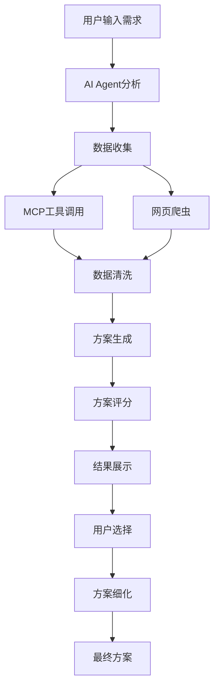

# LX SkyRoam Agent - 项目总结

## 🎯 项目概述

LX SkyRoam Agent 是一个基于AI技术的智能旅游攻略生成系统，旨在为用户提供个性化、专业化的旅行方案规划服务。

## 🏗️ 系统架构

### 技术栈
- **后端**: FastAPI + Python 3.10
- **前端**: React + TypeScript + Ant Design
- **数据库**: PostgreSQL + Redis
- **任务队列**: Celery + Redis
- **AI服务**: OpenAI GPT-4
- **容器化**: Docker + Docker Compose
- **地图服务**: Leaflet + OpenStreetMap

### 核心模块

#### 1. AI Agent 核心引擎
- **数据收集器** (`DataCollector`): 从多个数据源收集旅行信息
- **数据处理器** (`DataProcessor`): 数据清洗和可信度评分
- **方案生成器** (`PlanGenerator`): 生成多种风格的旅行方案
- **方案评分器** (`PlanScorer`): 对方案进行多维度评分

#### 2. MCP 工具集成
- **航班查询**: 集成航班API获取实时价格和时刻
- **酒店预订**: 整合酒店预订平台数据
- **景点信息**: 收集景点详情、评分、开放时间
- **天气服务**: 获取目的地天气预报
- **餐厅推荐**: 提供当地美食推荐
- **交通信息**: 整合公共交通和租车服务

#### 3. 网页爬虫系统
- **智能爬虫**: 自动补充缺失数据
- **反爬虫机制**: 实现延迟、代理轮换等策略
- **数据清洗**: 去除重复和无效信息

#### 4. 数据管理系统
- **PostgreSQL**: 主数据库，存储结构化数据
- **Redis**: 缓存和会话存储
- **数据模型**: 用户、计划、目的地、景点、餐厅等

#### 5. 后台任务系统
- **Celery**: 异步任务处理
- **定时任务**: 数据更新、缓存清理、健康检查
- **监控系统**: 系统资源监控和告警

## 🚀 核心功能

### 1. 智能方案生成
- **多方案对比**: 生成3-5个不同风格的方案
- **个性化定制**: 根据用户偏好调整方案
- **实时优化**: 基于最新数据动态调整

### 2. 数据源整合
- **官方API**: 航班、酒店、天气等官方数据
- **第三方平台**: 携程、去哪儿、Booking等
- **用户评价**: 整合多平台用户评价数据

### 3. 智能评分系统
- **多维度评分**: 价格、评分、便利性、安全性、受欢迎程度
- **权重调整**: 根据用户偏好动态调整评分权重
- **可信度评估**: 对数据源进行可信度评分

### 4. 用户体验优化
- **响应式设计**: 支持PC、平板、手机多端访问
- **实时反馈**: 方案生成进度实时显示
- **交互式地图**: 集成地图显示行程路线
- **导出功能**: 支持PDF、HTML、JSON格式导出

## 📊 数据流程

## 🔧 部署架构

### Docker 容器化部署
- **PostgreSQL**: 数据库服务
- **Redis**: 缓存和消息队列
- **Backend**: FastAPI应用
- **Frontend**: React应用
- **Celery Worker**: 异步任务处理
- **Celery Beat**: 定时任务调度
- **Flower**: Celery监控界面

### Windows 下 Celery 并发与限制
- Windows 平台不支持软超时与部分信号，默认多进程池易出现兼容性异常（如 `billiard` 解包错误）
- 默认建议使用 `solo` 池（单进程），稳定但并发为 1；需要并发可用以下方式：
- 线程池并发：启动参数 `--pool=threads --concurrency=N`，适合 I/O 密集型任务（需确保线程安全）
- 横向扩容：启动多个 Worker 实例，每个 `--pool=solo`，以总进程数获得并发
- 最佳实践：在 Linux/WSL2/Docker Linux 环境使用默认多进程并发（prefork），稳定性更好

### 环境变量示例（Celery/Redis）
- `REDIS_URL=redis://<host>:6379/0`
- `CELERY_BROKER_URL=redis://<host>:6379/1`
- `CELERY_RESULT_BACKEND=redis://<host>:6379/2`
- `CELERY_WORKER_POOL=solo`（Windows 推荐：`solo`；或尝试 `threads`）
- `CELERY_WORKER_CONCURRENCY=1`（Windows/solo 为 1；threads 可设置 >=2）

> 说明：代码中已支持通过上述环境变量覆盖默认池类型与并发；未设置时，Windows 默认使用 `solo`，*nix 默认并发来自 `MAX_CONCURRENT_TASKS`。

### 环境配置
- **开发环境**: 本地Docker Compose
- **生产环境**: Kubernetes集群部署
- **CI/CD**: GitHub Actions自动化部署

## 📈 性能优化

### 1. 缓存策略
- **Redis缓存**: 热点数据缓存1-24小时
- **CDN加速**: 静态资源CDN分发
- **数据库优化**: 索引优化和查询优化

### 2. 并发处理
- **异步处理**: 使用asyncio提高并发性能
- **任务队列**: Celery处理耗时任务
- **连接池**: 数据库和Redis连接池

### 3. 监控告警
- **系统监控**: CPU、内存、磁盘使用率
- **应用监控**: API响应时间、错误率
- **业务监控**: 方案生成成功率、用户满意度

## 🔒 安全措施

### 1. 数据安全
- **数据加密**: 敏感数据加密存储
- **访问控制**: 基于角色的权限管理
- **数据备份**: 定期数据备份和恢复

### 2. API安全
- **身份验证**: JWT Token认证
- **请求限流**: 防止API滥用
- **输入验证**: 严格的输入参数验证

### 3. 系统安全
- **容器安全**: 最小权限原则
- **网络安全**: 防火墙和VPN
- **日志审计**: 完整的操作日志记录

## 🎨 用户界面

### 1. 首页
- **需求输入**: 目的地、时间、预算、偏好
- **功能展示**: 系统特色和优势介绍
- **用户评价**: 真实用户反馈展示

### 2. 方案生成页
- **进度显示**: 实时显示生成进度
- **步骤引导**: 清晰的操作步骤
- **状态反馈**: 详细的处理状态

### 3. 方案详情页
- **多方案对比**: 并排显示不同方案
- **详细信息**: 航班、酒店、景点详情
- **地图集成**: 可视化行程路线
- **预算分析**: 详细的费用 breakdown

### 4. 历史记录页
- **计划管理**: 查看、编辑、删除历史计划
- **状态跟踪**: 计划生成状态跟踪
- **快速操作**: 一键重新生成方案

## 🔮 未来规划

### 1. 功能扩展
- **语音交互**: 支持语音输入和输出
- **AR导航**: 增强现实导航功能
- **社交分享**: 方案分享和社区功能
- **多语言支持**: 国际化多语言界面

### 2. 技术升级
- **AI模型优化**: 更先进的AI算法
- **实时数据**: 更多实时数据源集成
- **边缘计算**: 边缘节点部署
- **区块链**: 数据可信度验证

### 3. 商业模式
- **会员服务**: 高级功能和优先服务
- **合作伙伴**: 与旅游平台深度合作
- **API服务**: 为第三方提供API服务
- **数据服务**: 旅游数据分析和报告

## 📝 开发指南

### 快速开始
1. 克隆项目: `git clone <repository-url>`
2. 配置环境: 复制 `env.example` 到 `.env` 并配置
3. 启动服务: 运行 `./start.sh` (Linux/Mac) 或 `start.bat` (Windows)
4. 访问应用: http://localhost:3000

### 开发环境
- **后端开发**: `cd backend && uvicorn main:app --reload`
- **前端开发**: `cd frontend && npm start`
- **数据库迁移**: `alembic upgrade head`
- **测试运行**: `pytest`

### 代码规范
- **Python**: 使用 Black 格式化，遵循 PEP 8
- **TypeScript**: 使用 ESLint 和 Prettier
- **提交规范**: 遵循 Conventional Commits
- **文档**: 使用 Sphinx 生成API文档

## 🤝 贡献指南

欢迎贡献代码！请遵循以下步骤：
1. Fork 项目
2. 创建功能分支: `git checkout -b feature/amazing-feature`
3. 提交更改: `git commit -m 'Add amazing feature'`
4. 推送分支: `git push origin feature/amazing-feature`
5. 创建 Pull Request

## 📄 许可证

本项目采用 GPL3.0 许可证 - 查看 [LICENSE](LICENSE) 文件了解详情。

## 🙏 致谢

感谢所有为这个项目做出贡献的开发者和用户！

---

**LX SkyRoam Agent** - 让每一次旅行都成为美好回忆 ✈️🌍
